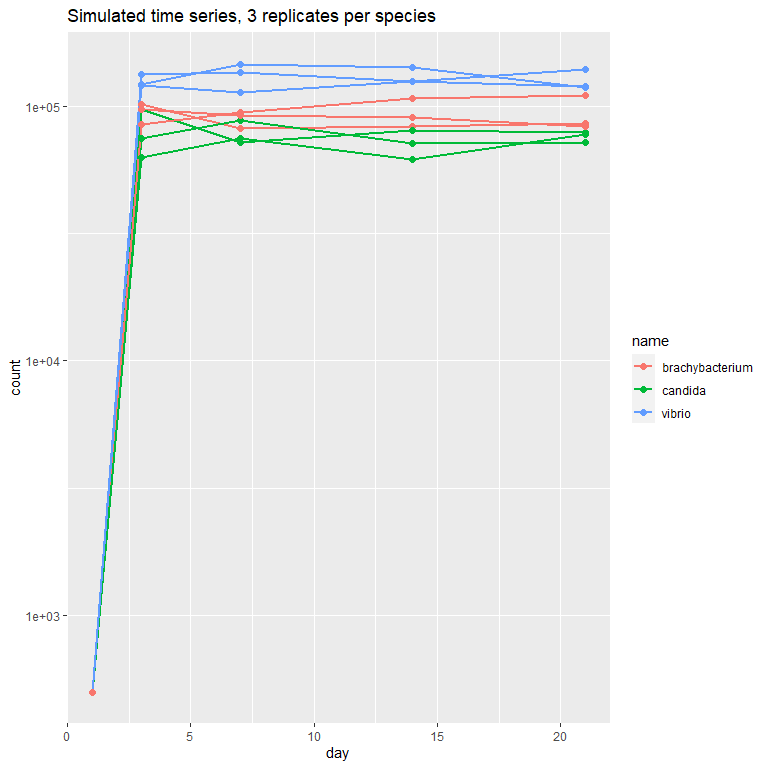
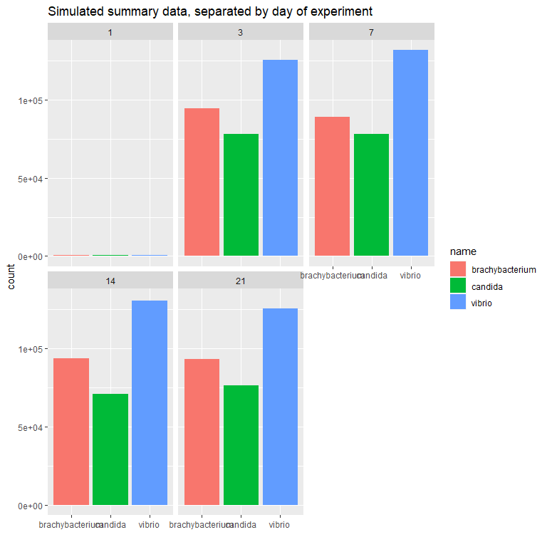
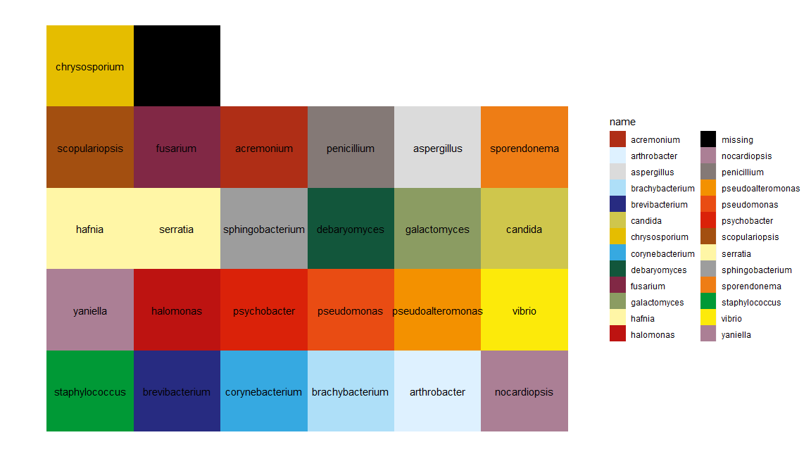
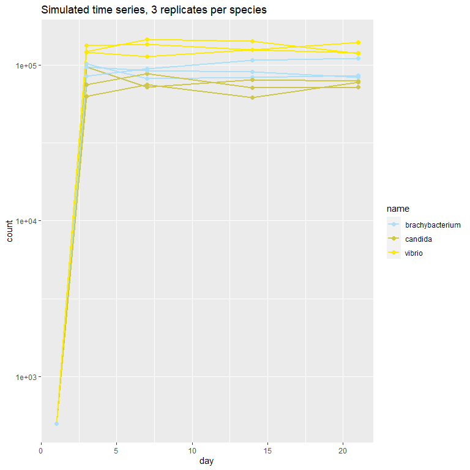

<!-- README.md is generated from README.Rmd. Please edit that file -->

``` r
library(ggplot2)
library(dplyr)
#> 
#> Attaching package: 'dplyr'
#> The following objects are masked from 'package:stats':
#> 
#>     filter, lag
#> The following objects are masked from 'package:base':
#> 
#>     intersect, setdiff, setequal, union
library(wolfeR)
```

# wolfeR

<!-- badges: start -->
<!-- badges: end -->

The goal of wolfeR is to streamline color schemes for plots of the
microbes used in the Wolfe lab at Tufts.

## Installation

You can install the development version of wolfeR from
[GitHub](https://github.com/) with:

``` r
# install.packages("devtools")
devtools::install_github("cbedwards/wolfeR")
```

## Useage

We often need to create plots of microbial abundance either aggregated
into bar plots or showing time series from experiments. The goal here is
streamline the process of using consistent colors for each taxa/species,
so that plots have consistent color interpretation across presentations,
publications, and working documents. This package provides ready-made
access to formalized color palettes in the form of a few functions that
integrate with ggplot.

### generating data

Let’s start with some simulated data that resembles real time series
data from the Wolfe lab. Here we’re imagining we carried out an
experiment where we measured the abundance of three species across four
time points, using three replicates each.

``` r
dat = as.data.frame(expand.grid(name = c("candida", "vibrio",
                                         "brachybacterium"), #species name
                                day = c(1, 3, 7, 14, 21), #day of time series
                                rep = 1:3,#replicate number
                                stringsAsFactors = FALSE))
dat$count = 500 + #baseline
  100000 * (dat$day>1) +  #population generally gets near carrying capacity
  #  after first measurement
  (dat$day>1) * -20000*(dat$name == "candida") +#make candida CC lower
  (dat$day>1) *  30000*(dat$name == "vibrio") + #make vibrio CC higher
  (dat$day>1) * runif(nrow(dat), min = -20000, max = 20000)
# add some random noise to observations except day 1
```

### without wolfeR

ggplot figures default to a single color scheme, which (a) doesn’t match
Wolfe lab publications, but also (b) is based on the data given. So if
we make a plot for one experiment in which we had four species, and
another plot for a second experiment with four species, two of which
overlapped with the first, there is no guarantee that any of the colors
match up between our two plots (even though we would want the two
overlapping species to use the same colors).

Here’s what the time series looks like for our simulated data:

``` r
ggplot(data = dat, aes(x = day,
                       y = count,
                       group = interaction(name, rep),
                       color = name))+
  geom_path(size = 0.8)+
  geom_point(size = 2)+
  scale_y_log10()+
  ggtitle("Simulated time series, 3 replicates per species")
```

<!-- -->

And here’s what the barplots of that same data would look like,
averaging across replicates and separated across days with
`facet_wrap()`:

``` r
dat.summary = dat %>%
  group_by(name, day) %>%
  summarize(count = mean(count))
#> `summarise()` has grouped output by 'name'. You can override using the
#> `.groups` argument.
ggplot(data = dat.summary,
       aes(x = name, y = count, fill = name))+
  geom_col()+
  facet_wrap(~ day)+
  xlab("")+
  ggtitle("Simulated summary data, separated by day of experiment")
```

<!-- -->

### Using wolfeR for colors

First, we need to choose which color palette we want. See
`help("make_colorvec")` for details; as of the writing of this README,
only the color scheme based on Wolfe 2014 (`palette.name = "wolfe2014"`)
is implemented. We can try visualizing a palette with `palette_vis()`.

``` r
## showing the default palette
palette_vis("wolfe2014")
```

<!-- -->

With the palette in mind, we should check that our data doesn’t have any
taxa / names that aren’t present in the color palette. `palette_check()`
is our friend there.

``` r
# check the palette
palette_check(dat$name, "wolfe2014")
#> All data identifiers represented in this palette. Nice work!
```

As an experiment, let’s see what happens if we give it a vector with
some non-represented taxa. I’ll give a vector of names that are
reasonable, plus the species name for common milkweed.

``` r
# check the palette
palette_check(c("candida", "vibrio", "brachybacterium", "Asclepias syriaca"), "wolfe2014")
#> Some data identifiers are not present in the palette.
#> data identifiers without colors:
#> Asclepias syriaca
#> 
#> data identifiers in this palette:
#> staphylococcus
#> brevibacterium
#> corynebacterium
#> brachybacterium
#> arthrobacter
#> nocardiopsis
#> yaniella
#> halomonas
#> psychobacter
#> pseudomonas
#> pseudoalteromonas
#> vibrio
#> hafnia
#> serratia
#> sphingobacterium
#> debaryomyces
#> galactomyces
#> candida
#> scopulariopsis
#> fusarium
#> acremonium
#> penicillium
#> aspergillus
#> sporendonema
#> chrysosporium
#> missing
#> 
#> (note that R needs exact spelling + capitalization match. Check for typos!)
#> (in development: function to add new colors to the palettes for new taxa etc)
```

KEY POINT: We need *exact* matches between the names in your data and
the names in the palette, including capitalization etc. If it seems like
the palette should be working, but it’s not, check for typos,
capitalization, spaces, etc.

Okay, but when we checked our actual data, with
`palette_check(dat$name, "wolfe2014")`, it gave us the all-clear.

Now we can re-create our figures using the new color palette. If we’re
working with points and lines, `scale_color_wolfe()` will (generally)
add the appropriate colors (for some non-default types of points, we may
need to use fill instead). If we’re working with bars etc,
`scale_fill_wolfe()` will add the appropriate colors.

These functions both need (a) the vector of taxa names from the data
being used (the `dat.names` argument), and (b) the name of the color
palette (the `palette.name` argument, defaults to `"wolfe2014"`. (a)
seems silly, but is actually really important, because if ggplot gets a
list of colors that includes taxa not in our data, it behaves poorly (it
assumes we want a color gradient instead, and gives gray colors).

``` r
ggplot(data = dat, aes(x = day,
                       y = count,
                       group = interaction(name, rep),
                       color = name))+
  geom_path(size = 0.8)+
  geom_point(size = 2)+
  scale_y_log10()+
  scale_color_wolfe(dat.names = dat$name, palette.name = "wolfe2014")+
  ggtitle("Simulated time series, 3 replicates per species")
```

<!-- -->

``` r
ggplot(data = dat.summary,
       aes(x = name, y = count, fill = name))+
  geom_col()+
  facet_wrap(~ day)+
  xlab("")+
  scale_fill_wolfe(dat.names = dat$name, palette.name = "wolfe2014")+
  ggtitle("Simulated summary data (by day of experiment)")
```

<!-- -->

TECHNICAL NOTE: these two functions are mostly just wrappers for
`scale_fill_discrete()` and `scale_color_discrete()`, and so can be
treated just like any other ggplot layer, including adding to existing
objects, etc.

## adding new color palettes

It is very easy for me to add new color palettes to the package if I’m
given - the name for the new color palette - a list of the taxa names -
a list of the corresponding colors, in R readable format (either
character strings for R colors, or in hex code (the format that starts
with a \# sign.. I found that [this site](https://colors.artyclick.com/)
was handy for extracting colors from publications.

I’m working on developing a function to augment existing palettes
without requiring me updating the package (so that you can work with the
existing palettes and some new taxa without waiting for me), but that is
not yet ready.
